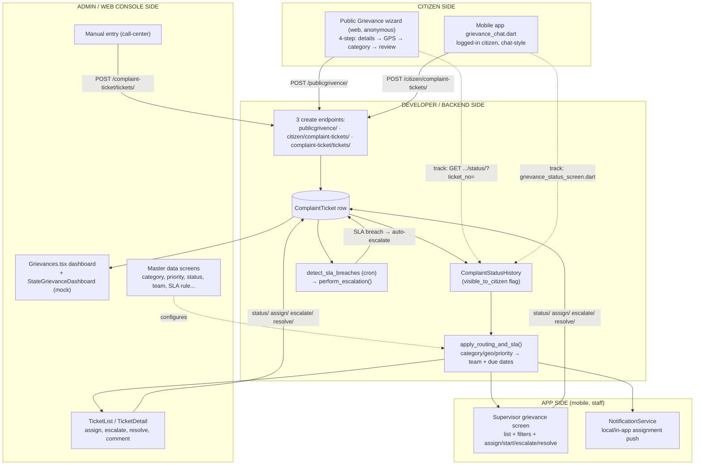
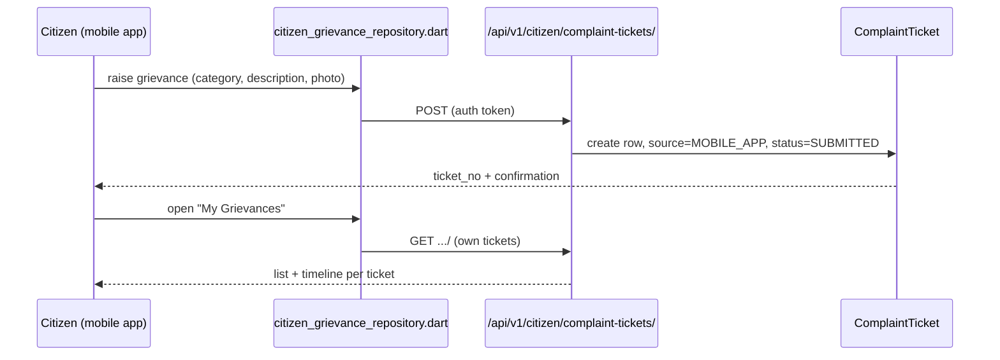
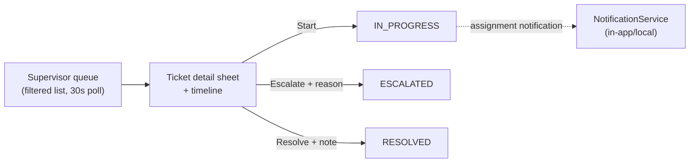
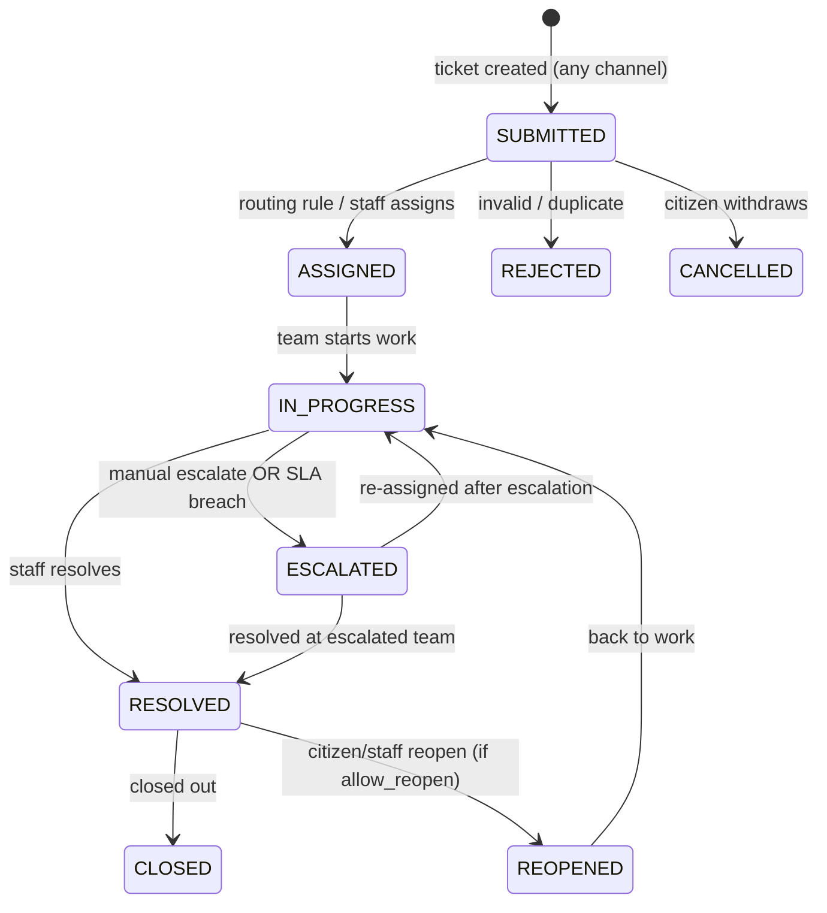
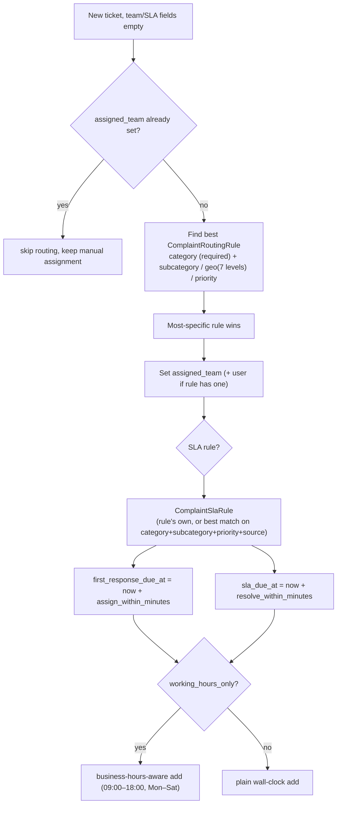
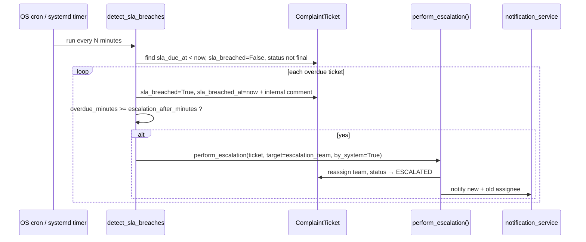
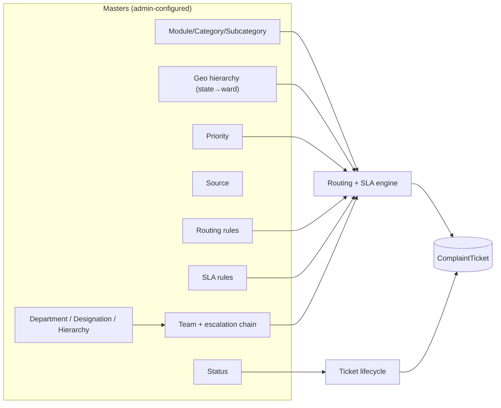

# Complaint / Grievance Management — End-to-End Flow

**IWMS Government Platform · Cross-Repo Systems Reference**

How a complaint moves through the system — from a citizen (public or in-app), through routing, SLA and escalation, to resolution — and every screen, model, and API involved, across all three repos.

- **Backend** — Django REST · `iwms-government-backend/app/models/complaint_ticket/`
- **Web frontend** — React/TS · `iwms-government-frontend/src/features/complaintTicketing/`, `src/pages/publicGrievance/`
- **Mobile app** — Flutter · `iwms-government-app/lib/modules/module1_citizen/`, `lib/modules/module5_supervisor/`

> A deeper backend-only reference already exists at `iwms-government-backend/COMPLAINT_GRIEVANCE_FLOW.md` (models, routing/SLA engine internals, API map). This document sits one level up: it ties that backend engine to the **mobile app** (citizen + supervisor) and the **web** (public + admin), and consolidates every master data table across all three repos.

## Contents

1. [Actors & entry points](#1-actors--entry-points)
2. [Overall system flow chart](#2-overall-system-flow-chart)
3. [Citizen side (public, no login)](#3-citizen-side-public-no-login)
4. [Citizen side (mobile app, logged in)](#4-citizen-side-mobile-app-logged-in)
5. [App side — supervisor / field staff (mobile)](#5-app-side--supervisor--field-staff-mobile)
6. [Admin / web console side](#6-admin--web-console-side)
7. [Ticket lifecycle (state machine)](#7-ticket-lifecycle-state-machine)
8. [Routing, SLA & escalation engine (developer side)](#8-routing-sla--escalation-engine-developer-side)
9. [All masters — consolidated](#9-all-masters--consolidated)
10. [File map by repo](#10-file-map-by-repo)
11. [Known gaps](#11-known-gaps)

---

## 1. Actors & entry points

| Actor | Where | Auth | Enters via |
|---|---|---|---|
| **Anonymous citizen** | Web — Public Grievance wizard | None | `iwms-government-frontend/src/pages/publicGrievance/` |
| **Registered citizen** | Mobile app | Logged in as `CustomerCreation` | `module1_citizen/citizen/grievance_chat.dart` |
| **Call-center / admin staff** | Web console | Staff login | `complaintTicketing` manual entry form |
| **Supervisor / field team lead** | Mobile app | Staff login | `module5_supervisor/presentation/screens/supervisor_grievance_screen.dart` |
| **Department admin / leadership** | Web dashboards | Staff/admin login | `Grievances.tsx`, `StateGrievanceDashboard.tsx` |
| **System (developer-built automation)** | Backend cron | N/A | `apply_routing_and_sla()`, `detect_sla_breaches` mgmt command |

Every entry point writes to the **same** `ComplaintTicket` table and passes through the **same** routing/SLA engine — channel only changes what fields are trusted and how much of the workflow is visible back to the submitter.

---

## 2. Overall system flow chart

---

## 3. Citizen side (public, no login)

Web-only, `iwms-government-frontend/src/pages/publicGrievance/`.

1. **Your details** — name + gender required; phone/email optional (share-toggle), never OTP-verified.
2. **Location** — GPS prompt + Leaflet map pin-drag; reverse-geocode via OpenStreetMap Nominatim directly from the browser. State/district/city dropdowns optional.
3. **Complaint type** — category (required), subcategory (if any exist for that category), description (≤1000 chars), optional photo.
4. **Review & submit** — `multipart/form-data` POST including a `device_id` from `localStorage`.

Server resolves category → `OTHER` fallback → first active; priority from waste type → subcategory → category → hardcoded `P3`; team via the shared routing engine. Tracking is inline on the same page: ticket-number or mobile-number search against `GET /publicgrivence/status/`, rendering a 4-stage tracker (Submitted → Assigned → In Progress → Resolved) built from `ComplaintStatusHistory` rows flagged `visible_to_citizen=True`.

---

## 4. Citizen side (mobile app, logged in)

`lib/modules/module1_citizen/citizen/`:

- `grievance_chat.dart` — chat-style wizard to raise a complaint. Category required; phone, name, and full geo hierarchy are copied from the citizen's `CustomerCreation` profile (not re-entered). Source defaults to `MOBILE_APP`, initial status `SUBMITTED`.
- `grievance_status_screen.dart` — lists the citizen's own tickets with live status + timeline, backed by `GrievanceTicket` / `GrievanceTimelineEvent` models (`lib/data/models/grievance_ticket_model.dart`) via `citizen_grievance_repository.dart` → `GET/POST /api/v1/citizen/complaint-tickets/`.

---

## 5. App side — supervisor / field staff (mobile)

`lib/modules/module5_supervisor/`:

- **`presentation/screens/supervisor_grievance_screen.dart`** — ticket queue with filter chips (`all / raised / pending / escalated / resolved`), summary cards, 30-second silent poll for new tickets, color-coded status chips (`SUBMITTED/DRAFT` blue, `ASSIGNED` indigo, `IN_PROGRESS` amber, `ESCALATED` red, `RESOLVED` green, `CLOSED` grey, `REOPENED` orange).
- **`data/supervisor_grievance_repository.dart`** — hits `/grievance/tickets/{id}/status/`, `/escalate/`, `/resolve/`.
- Per-ticket actions available to the supervisor: **Start** (→ `IN_PROGRESS`), **Escalate** (with reason, → `ESCALATED`), **Resolve** (with note, → `RESOLVED`); a detail sheet shows the full status timeline.
- New assignments surface via `NotificationService.showAssignmentNotification()` — local/in-app only, no SMS/push-service integration found in code.

`module4_admin` screens (`admin_home_page.dart`, `dashboard_screen.dart`) reference grievance stats for read-only KPI display, but full admin CRUD lives on the web console, not mobile.

---

## 6. Admin / web console side

`iwms-government-frontend/src/features/complaintTicketing/` and `src/pages/admin/modules/core_modules/complaintManagement/`:

- **`tickets/TicketList.tsx` / `TicketDetail.tsx`** — full ticket list + detail, scoped by role (superuser/`?all=1` sees everything; admin/supervisor sees their geo subtree; staff sees only their own assignments).
- **`tickets/TicketForm.tsx`** — manual staff entry (phone-in / walk-in complaints), 3-step: Citizen → Complaint → Location; picking an existing customer auto-fills contact + geo.
- **Actions**: assign/reassign (staff picker scoped by district/city/department), change status, escalate, resolve, reopen, add comments/attachments, record citizen feedback, verify/approve/reject address-change requests.
- **Master screens**: `category/`, `subcategory/`, `masters/` (Module, Priority, Status, Source, Team, SlaRule forms + lists), `ReferenceDataScreen.tsx`.
- **Dashboards**: `Grievances.tsx` (live KPIs), `StateGrievanceDashboard.tsx` (currently mock data — see [gaps](#11-known-gaps)).
- **Public wizard code** also lives in this repo at `src/pages/publicGrievance/` (see [§3](#3-citizen-side-public-no-login)).

---

## 7. Ticket lifecycle (state machine)

Statuses are data-driven (`ComplaintStatus` rows carry `is_final` / `allow_reopen` flags), but the console, dashboards, and mobile queue all exercise this exact path:

**Filter buckets** (used by both the web console and the mobile supervisor screen): `pending` = SUBMITTED, ASSIGNED · `started` = IN_PROGRESS · `escalated` = ESCALATED · `resolved` = RESOLVED, CLOSED, REJECTED, CANCELLED.

Every transition writes a `ComplaintStatusHistory` row (`changed_by_system` / `changed_by_user`, `visible_to_citizen`) — that flag alone gates what the citizen tracker (web) and `grievance_status_screen.dart` (mobile) can see.

---

## 8. Routing, SLA & escalation engine (developer side)

Single shared function, `apply_routing_and_sla()` (backend), runs after every ticket creation regardless of channel. It only fills **empty** fields — a manual assignment is never overwritten.

SLA breach detection has **no Celery/task queue** — it's a Django management command run on a schedule (cron): `python manage.py detect_sla_breaches`.

The same `perform_escalation()` backs the console's manual **Escalate** button and the mobile supervisor's **Escalate** action — `escalation_level` increments each time; a ticket at the top of its escalation chain returns an error instead of looping.

---

## 9. All masters — consolidated

### 9.1 Complaint-domain masters (admin-editable, drive automation)

| Master | Purpose | Where managed |
|---|---|---|
| `ComplaintModule` / `Category` / `Subcategory` | What the complaint is about; category carries `default_priority`, `default_team`, and flags for required location/media/address-detail | Web: `masters/`, `category/`, `subcategory/` |
| `ComplaintPriority` | P1 Emergency → P4 Info, `sort_order` | Web: `masters/` (Priority) |
| `ComplaintStatus` | Lifecycle states + `is_final` / `allow_reopen` flags — state machine is data-driven | Web: `masters/` (Status) |
| `ComplaintSource` | Web, WhatsApp, Mobile App, Call Center, Admin, Public Grievance | Web: `masters/` (Source) |
| `ComplaintTeam` | Lead staff, department, `escalates_to` parent team, `escalation_level` | Web: `masters/` (Team) |
| `ComplaintRoutingRule` | category (+ subcategory/geo/priority) → team; most-specific wins | Web: `masters/` (routing rules) |
| `ComplaintSlaRule` | category (+ subcategory/priority/source) → assign/resolve/escalate-after minutes, business-hours flag | Web: `masters/` (SlaRule) |

### 9.2 Geography / org masters

| Master | Location |
|---|---|
| State / District / Corporation / Municipality / Panchayat / Panchayat Union / Block Panchayat Union / Town Panchayat / Ward / Area type | `iwms-government-backend/app/models/masters/` |
| Department | `.../masters/department.py` |
| Designation | `.../masters/designation.py` |
| Hierarchy / Hierarchy Assignment / Hierarchy Tree | `.../masters/hierarchy*.py` |

### 9.3 Other domain masters (referenced by complaint category/waste-type resolution)

| Master group | Location |
|---|---|
| Customer masters (`CustomerCreation`, etc.) | `.../models/customer_masters/` |
| Waste masters (bins, property, subproperty, waste type) | `.../models/waste_masters/` |
| Transport masters | `.../models/transport_masters/` |

### 9.4 Master data flow

---

## 10. File map by repo

| Repo | Layer | Path |
|---|---|---|
| Backend | Ticket + audit models | `app/models/complaint_ticket/` |
| Backend | Geo/org masters | `app/models/masters/` |
| Backend | Routing/SLA engine | `apply_routing_and_sla()`, `perform_escalation()` |
| Backend | SLA breach cron | `management/commands/detect_sla_breaches.py` (name indicative) |
| Backend | Deep reference doc | `COMPLAINT_GRIEVANCE_FLOW.md` |
| Frontend (web) | Public wizard | `src/pages/publicGrievance/` |
| Frontend (web) | Admin console | `src/features/complaintTicketing/`, `src/pages/admin/modules/core_modules/complaintManagement/` |
| Frontend (web) | Master screens | `.../complaintManagement/masters/`, `category/`, `subcategory/` |
| Frontend (web) | Dashboards | `src/pages/dashboard/pages/types/Grievances/`, `StateGrievanceDashboard.tsx` |
| Frontend (web) | Schemas | `src/schemas/core_modules/complaintManagement/` |
| Mobile app | Citizen raise/track | `lib/modules/module1_citizen/citizen/grievance_chat.dart`, `grievance_status_screen.dart` |
| Mobile app | Citizen data layer | `lib/data/models/grievance_ticket_model.dart`, `lib/data/repositories/citizen_grievance_repository.dart` |
| Mobile app | Supervisor queue/actions | `lib/modules/module5_supervisor/presentation/screens/supervisor_grievance_screen.dart` |
| Mobile app | Supervisor data layer | `lib/modules/module5_supervisor/data/supervisor_grievance_repository.dart` |
| Mobile app | Notifications | `lib/shared/services/notification_service.dart` |
| Mobile app | Admin read-only stats | `lib/modules/module4_admin/` (`admin_home_page.dart`, `dashboard_screen.dart`) |

---

## 11. Known gaps

- **Public-form duplicate check disabled** — `device_id` cooldown constant exists but enforcement is commented out; citizens can submit unlimited complaints from one device.
- **No CAPTCHA/OTP on public intake** — phone/email are voluntary, unverified.
- **State-level web dashboard is mock data** (`StateGrievanceDashboard.tsx`) — figures are illustrative, not live.
- **Address-change history is shallow** — only the immediately-prior address snapshot is kept, no append-only history across multiple changes.
- **Notifications are in-app/local only** — no confirmed SMS/email/push-service integration for assignment or escalation alerts, on either mobile or web.
- **Staff identity ≠ Django `User`** — staff authenticate as `StaffcreationOfficeDetails`; audit history splits `*_by_user` vs `*_by_staff` columns accordingly.
